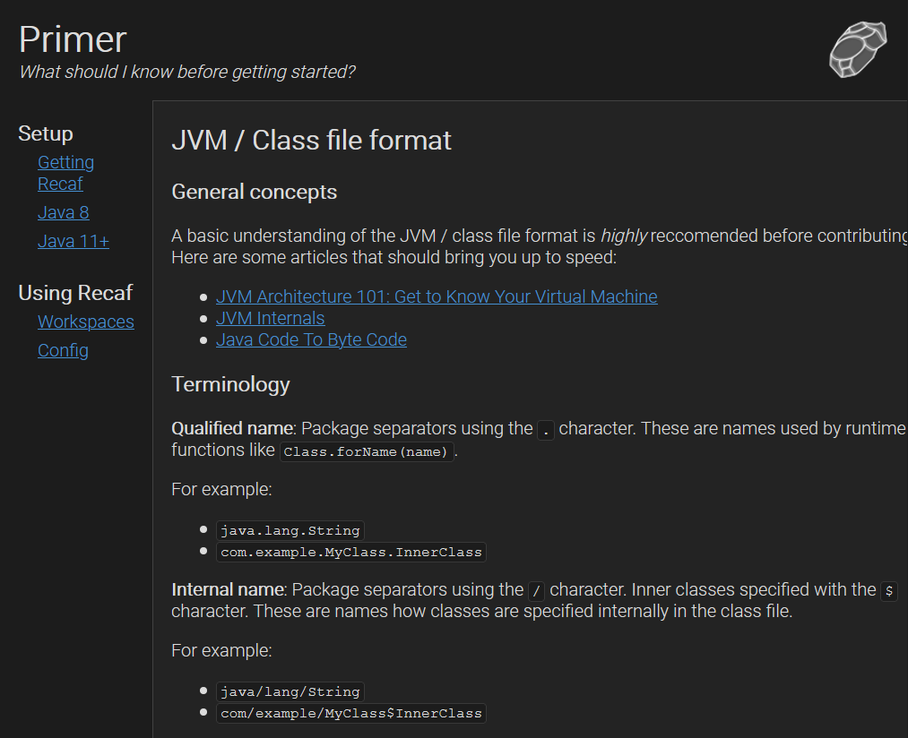

# Obsidian

A simplistic dark theme for Jekyll. Comes with code syntax highlighting.



## Installation

Add this line to your Jekyll site's `Gemfile`:

```ruby
gem "obsidian-theme"
```

And add this line to your Jekyll site's `_config.yml`:

```yaml
theme: obsidian-theme
```

And then execute:

    $ bundle

Or install it yourself as:

    $ gem install obsidian

## Usage

**Layouts**

At the moment only `default` exists.

**Assets**

Pluginable asset paths include:

- `assets/img/logo.png`
- `assets/img/favicon.png`

**Data**

To configure the side bar table-of-contents create a file `_data/sitemap.yml` and follow the given YAML pattern:

```yaml
toc:
  - title: MyTitleName
    subfolderitems:
      - page: Example Page 1
        url: /example1.html
```